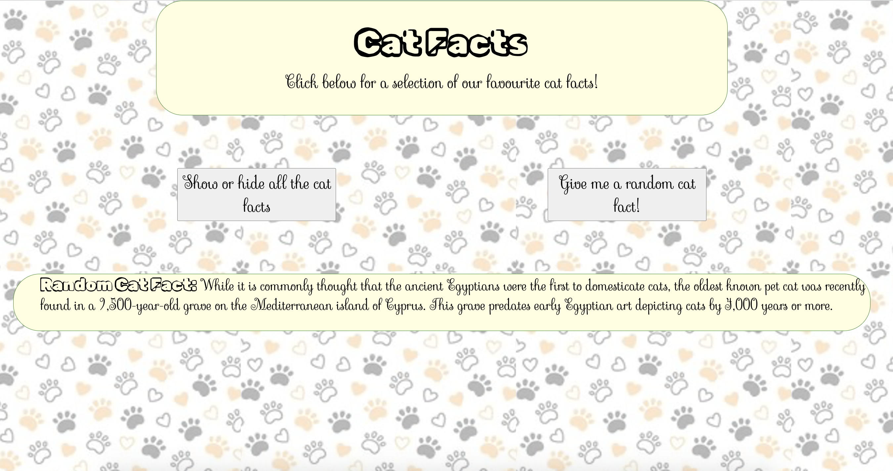

# Cat Facts

## Description
This was a small challenge during my coding course to apply recent learning on interacting with APIs in react. I practised using fetch and async/await by getting information from the cat ninja API and presenting it in different ways depending on where the user clicks. The user can either see all the cat facts or see individual, random cat facts. 

The project was also good practice in understanding react project architecture, passing down functions as props and using state to manage data. 

## Usage Instructions
* Click the 'show or hide all cat facts' button for the cat facts to be shown or hidden in the space at the bottom of the page. 
* Click the 'give me a random cat fact' button for a randomly chosen fact to appear in the yellow 'random cat fact box'.

## How it looks
